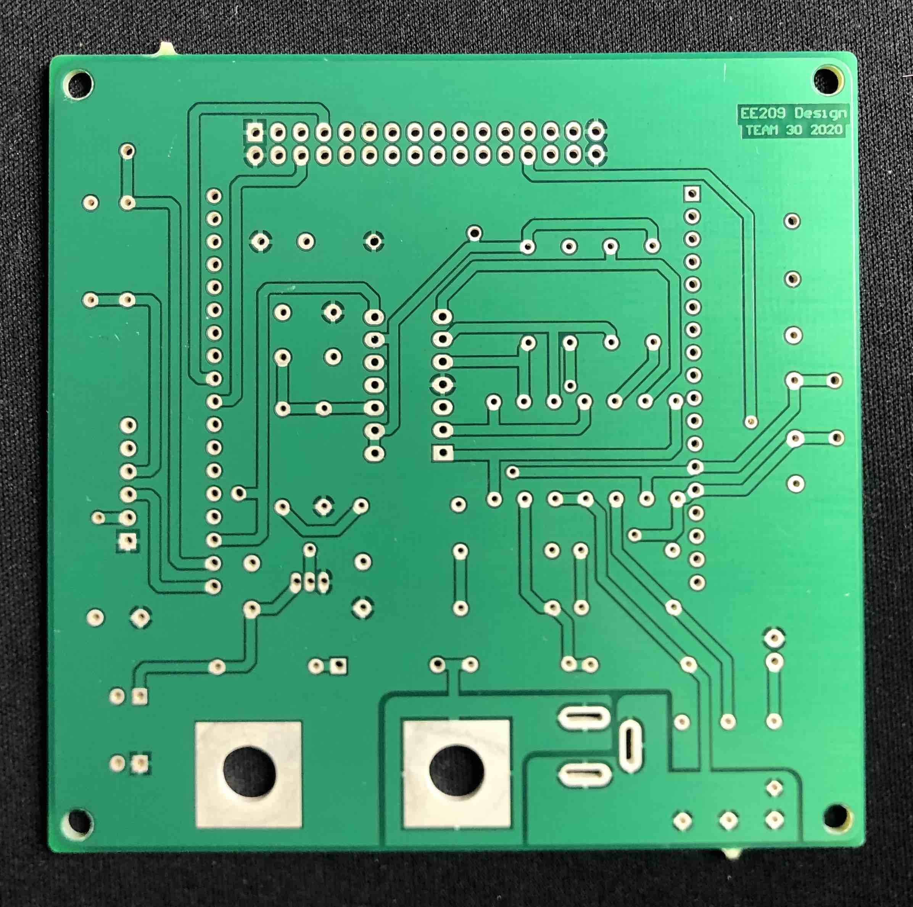
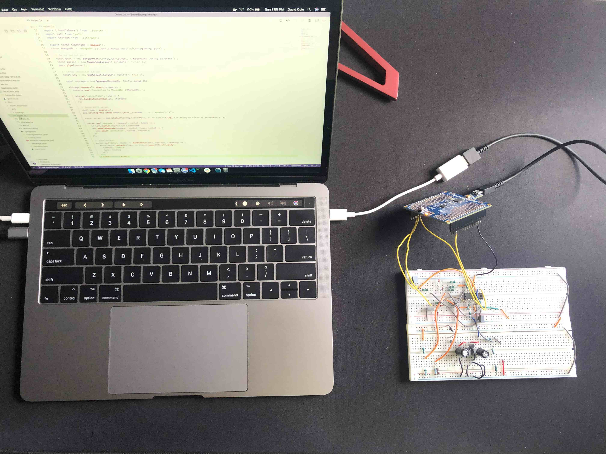
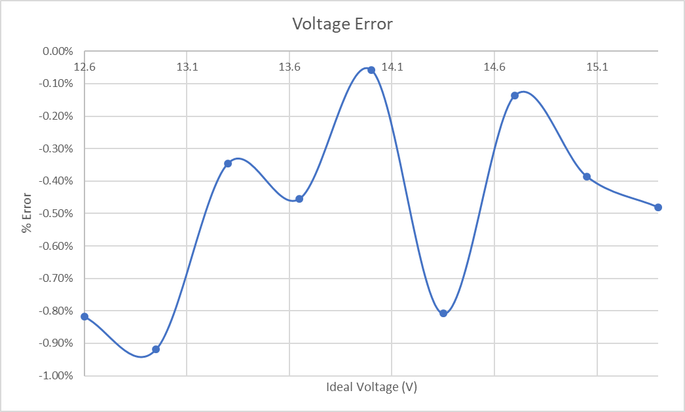
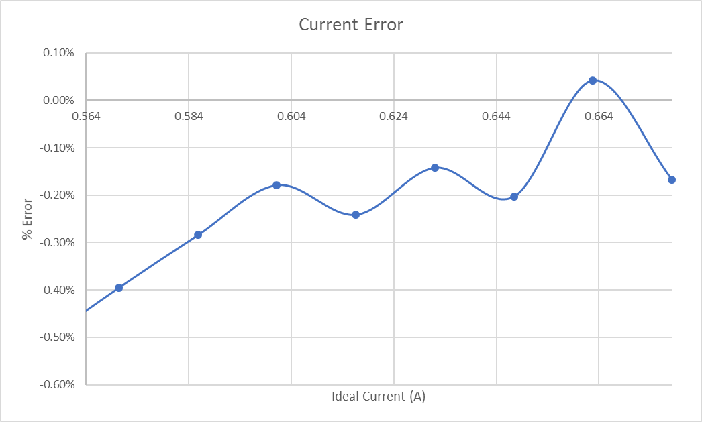
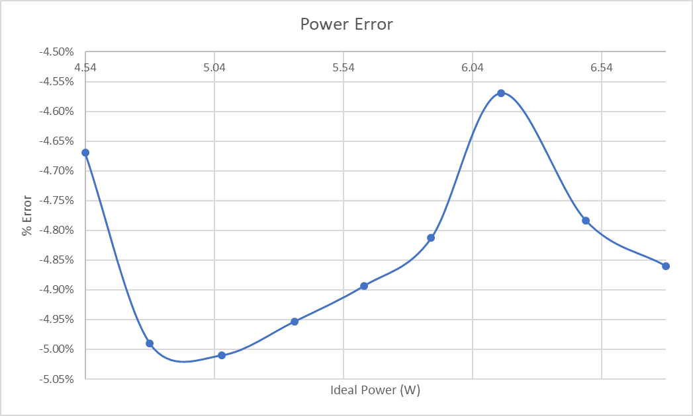
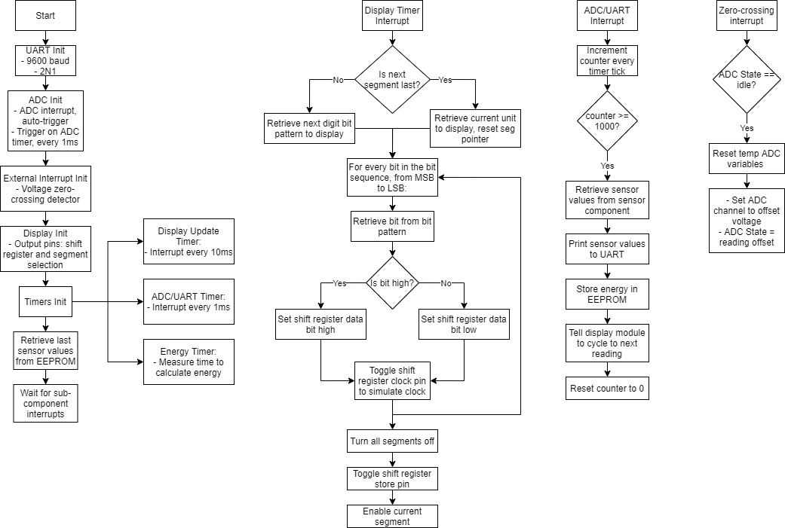
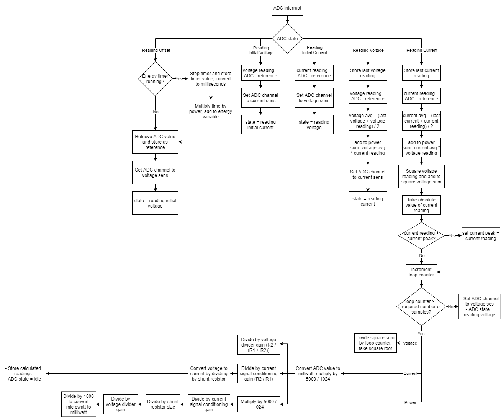
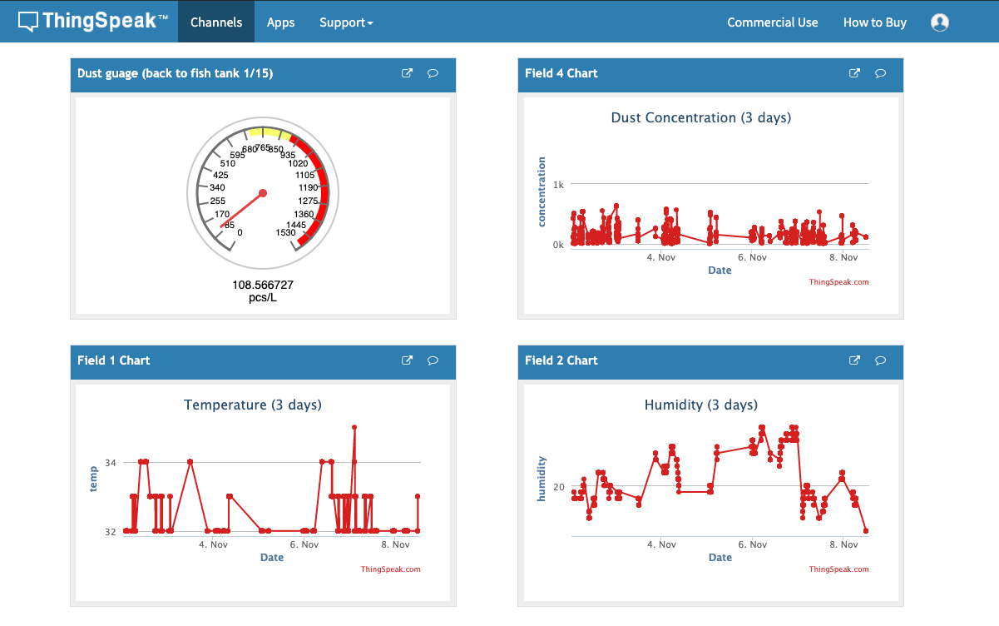
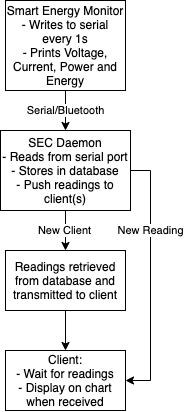
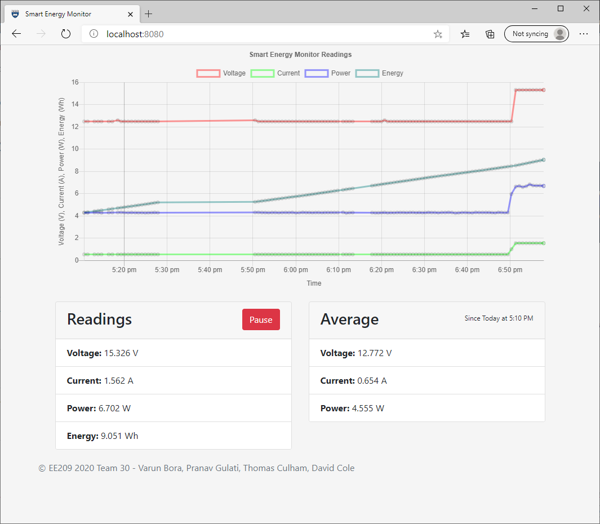

class: title-slide
count: false
.logo-title[]

# ELECTENG 209 Recap
### Building a Smart Energy Monitor

.TitleAuthor[Varun Bora, Thomas Culham, Pranav Gulati, David Cole]

---

layout: true
name: template_slide

.logo-slide[]
.footer[Team 30 - Varun Bora, Thomas Culham, Pranav Gulati, David Cole]

---
name: last_presentation

.last_presentation[
### Recap From Our Last Presentation
]

- Build a Bluetooth energy monitor that measures voltage, current, power and energy
- Development of sensors and signal conditioning circuits

.row[
.last-left[
.last_presentation[
### Since The Last Presentation
]
- Firmware finalized
- Set up sensors and signal conditioning circuits on breadboard
- PCB has arrived ready for assembly
- Smart Energy Challenge attempted
]

.last-right[
  
  <small>Figure I: PCB Design</small>
]
]

---
name: hardware

# Hardware

.row[
.row-left[
- Started to breadboard our project last week
- Learning about the wonders of noise in electrical signals
- Modified our firmware to work with the 16MHz clock vs. 800kHz
  - Timer configuration was designed to work with both clock speeds
  - Timer compare values are based off the `F_CPU` value, so not many changes required
- ADC sample frequency increased from 1kHz to 10kHz as the source was increased from 50Hz to 500Hz
]
.row-right[
  
  <small>Figure II: Breadboarding</small>
]
]

---
name: accuracy_1

# Accuracy (PI)

  

    
    <small>Figure III: Ideal vs Measured Voltage</small>
  

  

    
    <small>Figure IV: Ideal vs Measured Current</small>
  

---
name: accuracy_2

# Accuracy (PII)

  

.left[
- Brief was set to be within 5% of the true value
- Voltage and Current within 1%
- Power within 5%
  - Not as accurate as we would have liked
  - Likely due to the inefficiencies in the ADC interrupt
]
  

  

      
      <small>Figure V: Ideal vs Measured Power</small>
  

---
name: flowcharts

# Firmware Implementation

  

    
    <small>Figure VI: Main and sub-module logic</small>
  

  

    
    <small>Figure VII: ADC/Sensor logic</small>
  

???
- Usage of state in the ADC interrupt.
- Auto-triggering the ADC with a 1ms timer to ensure 1kHz sample rate.

---
name: sec_1

# Smart Energy Challenge (PI)

  

.left[
- Implement a web-based interface for data logging readings from the Smart Energy Monitor
- Option to utilize an IoT platform (ThingSpeak, Google Cloud IoT Core)
  - Not all platforms are free depending on usage
  - Limited customizability
- Ended up implementing a custom data logger and interface written in TypeScript
]
  

  

    
    <small>Figure VIII: ThingSpeak Interface</small>
    <small>Screenshot taken from https://thingspeak.com/channels/935349</small>
  

---
name: sec_2

# Smart Energy Challenge (PII)

  

.left[
- Daemon module:
  - Reads from Smart Energy Monitor serial port
  - Stores in a MongoDB database
  - Pushes latest readings to clients via WebSocket
- Web interface:
  - Receives readings from daemon and displays on a user-friendly chart
- Utilized open-source libraries:
  - chart.js and zoom plugin for HTML charts
  - React.js to tie the interface together
  - node-serialport to read from the USB-to-serial adapter and/or Bluetooth module
]
  

  

    
    <small>Figure IX: Challenge logic flowchart</small>
  

---
name: sec_3

# Smart Energy Challenge (PIII)

.center[
  
  <small>Figure X: Challenge interface</small>
]

---

class: title-slide
layout: false
count: false
.logo-title[]

# Acknowledgements
#### Special thanks to Duleepa and the TAs
#### for their valuable feedback and assistance throughout the semester.

---

class: title-slide
layout: false
count: false
.logo-title[]

# Questions?
### Thank you
